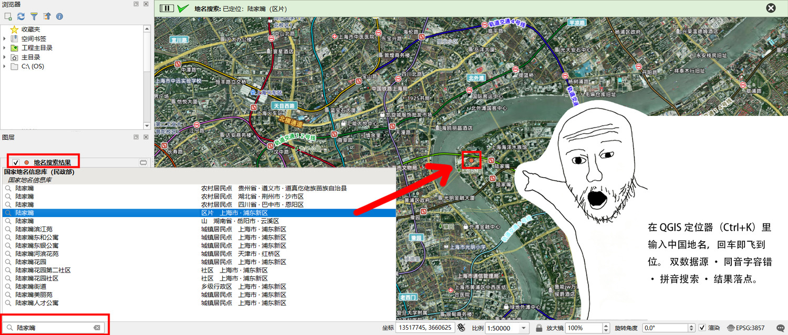
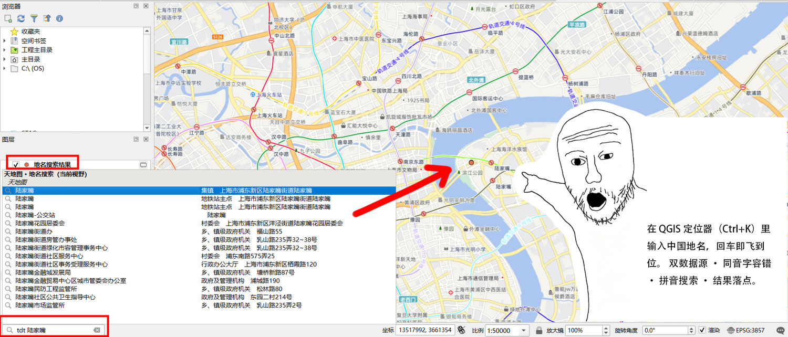
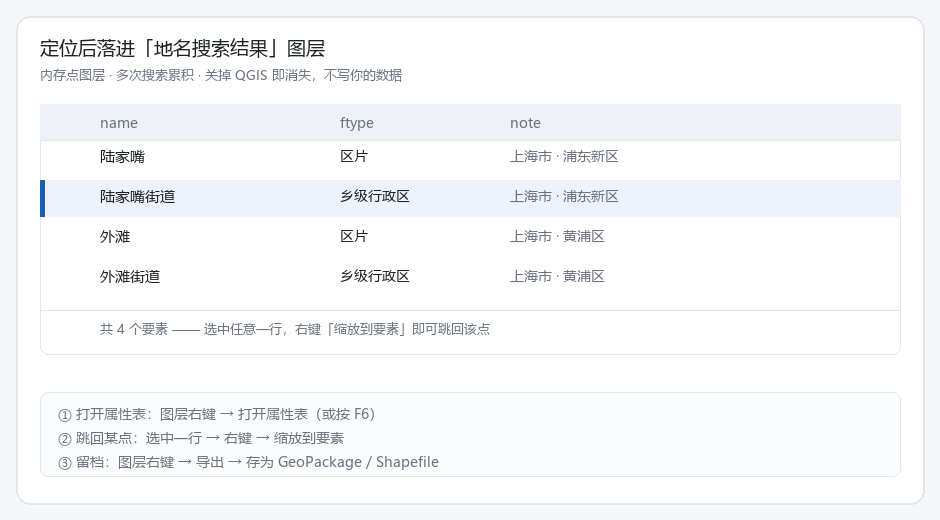
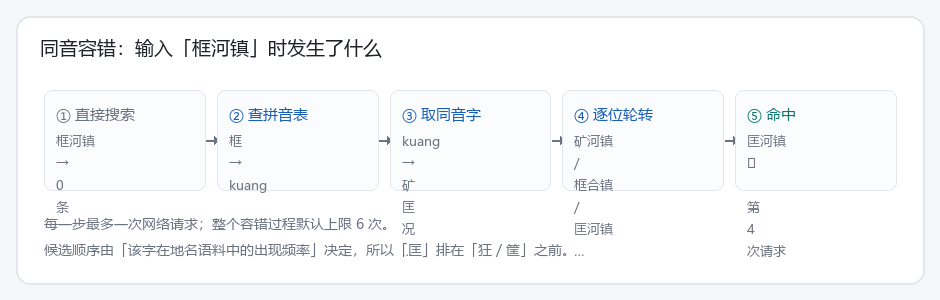
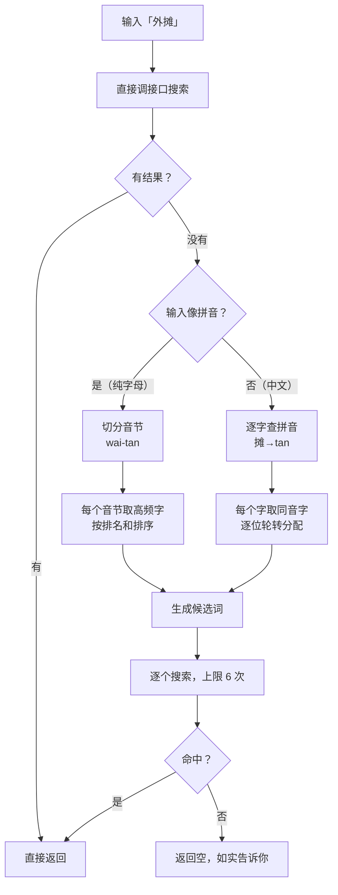
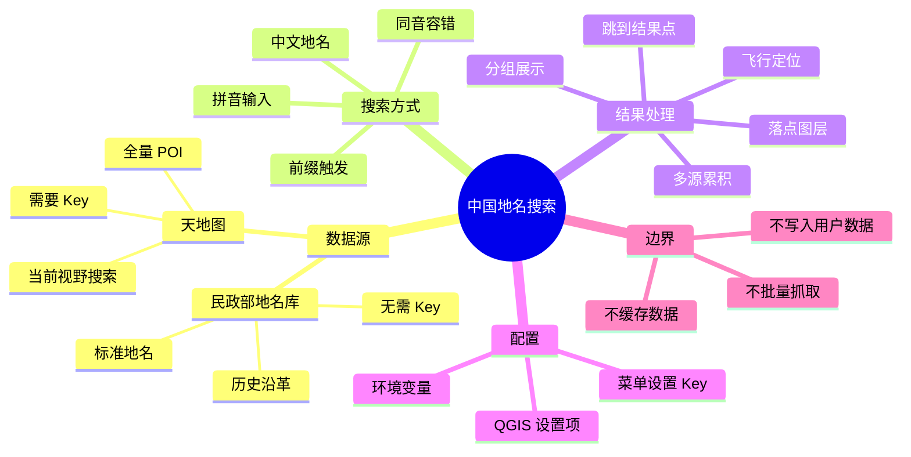
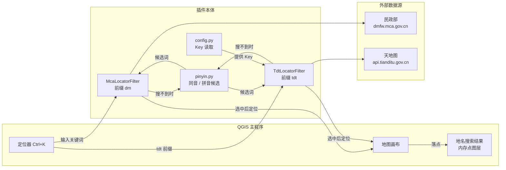

# 中国地名搜索 · QGIS 插件


> 在 QGIS 定位器（<kbd>Ctrl</kbd>+<kbd>K</kbd>）里输入中国地名，回车即飞到位。
> 双数据源 · 同音字容错 · 拼音搜索 · 结果落点。



<p align="center"><i>↑ QGIS 里实拍：底部定位器输入「陆家嘴」，候选分两组列出；左侧图层面板生成了「地名搜索结果」；地图飞到上海浦东并落点，状态栏显示「已定位: 陆家嘴（区片）」</i></p>

---

## 目录

| 章节 | 内容 |
|---|---|
| [一、解决什么问题](#一解决什么问题) | 为什么值得装 |
| [二、功能一览](#二功能一览) | 能力清单 |
| [三、快速上手](#三快速上手) | 三步用起来 |
| [四、使用方法详解](#四使用方法详解) | 输入规则、**结果点怎么用**、Key 配置 |
| [五、容错是怎么做到的](#五容错是怎么做到的) | 同音字 / 拼音的原理 |
| [六、功能导图](#六功能导图) | 一张图看全 |
| [七、工作原理](#七工作原理) | 架构与调用链 |
| [八、安装](#八安装) | ZIP / 手动 |
| [九、常见问题](#九常见问题) | FAQ |
| [十、数据来源与合规](#十数据来源与合规) | 用了哪些数据、怎么用的 |
| [十一、开发](#十一开发) | 目录结构与拼音表生成 |
| [十二、已知限制](#十二已知限制) | 做不到的事 |
| [十三、许可](#十三许可) | MIT |

---

## 一、解决什么问题

在 QGIS 里找一个地名，通常得这么折腾：

> 切到浏览器 → 打开地图网站 → 搜索 → 抄下坐标 → 切回 QGIS → 输入坐标定位

这个插件把它压缩成一次按键：**<kbd>Ctrl</kbd>+<kbd>K</kbd>，打地名，回车**。

三个具体的痛点：

**同名地名太多，分不清是哪一个。** 搜「陆家嘴」，民政部地名库返回 **42 条**——贵州道真、湖北荆州、四川巴中都有叫「陆家嘴」的村子，湖南岳阳还有个「陆家嘴」山。你要找的上海那个，得从省市那一行认出来。插件把省市直接摊在结果里，还带去重与分组。

**打错字就搜不到。** 想找「外滩」，打成「外摊」——主流地名接口都是纯字面匹配，直接给你 0 条，还不告诉你为什么。本插件会自动按同音字重试。

**想找的是"那一带有什么"。** 民政部地名库只收标准地名，找"附近的医院"它不是干这个的。天地图源按**当前地图视野**搜索，你看哪块就搜哪块。

---

## 二、功能一览

| 能力 | 说明 |
|---|---|
| **双数据源** | 民政部国家地名信息库（标准地名，带历史沿革）、天地图 POI（全量兴趣点） |
| **同音字容错** | 「外摊」→ 自动试出「外滩」；逐位轮转，词首词尾的错字都覆盖得到 |
| **拼音搜索** | 输 `waitan` 自动切分音节、转成汉字候选 |
| **视野内搜索** | 天地图源使用当前画布范围，级别由比例尺自动换算 |
| **分组展示** | 两个源的结果在定位器里分开成组，一眼看出哪条来自哪里 |
| **飞行定位** | 选中即飞到该位置，自动缩放到合适比例尺 |
| **结果落点** | 落在「地名搜索结果」内存图层，可随时**缩放到要素跳回**，多次搜索累积 |
| **Key 免改码** | 天地图 Key 在菜单里填，存在 QGIS 设置里，不写死在代码里 |
| **请求可控** | 平时 1 次请求；容错时最多再试 6 次，绝不后台扫数据 |

---

## 三、快速上手

**① 安装**（见 [八、安装](#八安装)），启用插件。

**② 按 <kbd>Ctrl</kbd>+<kbd>K</kbd>**，输入地名：

```
陆家嘴
```

**③ 回车**。地图飞到上海浦东，点上落一个标记。

想找 POI 就加 `tdt` 前缀（比如 `tdt 医院`）；打错字也没关系，插件会自己想办法。

---

## 四、使用方法详解

### 4.1 两个数据源有什么区别

拿「陆家嘴」实测：

| | 民政部 · 国家地名信息库 | 天地图 · 地名搜索 V2.0 |
|---|---|---|
| **触发方式** | 直接输入，或 `dm` 前缀 | **必须** `tdt` 前缀 |
| **返回总条数** | **42 条** | **10337 条** |
| **头几条是什么** | 贵州道真、湖北荆州、四川巴中的「陆家嘴」（农村居民点） | 上海浦东的陆家嘴（集镇）、地铁站、街道办 |
| **上海那条排第几** | 第 3 条（`陆家嘴 / 区片 / 上海市·浦东新区`） | 第 1 条 |
| **历史沿革 / 地名来历** | ✅ 独有 | ❌ |
| **按视野搜** | ❌ | ✅ |
| **需要 Key** | 不需要 | **需要** |
| **适合** | 查标准地名、查沿革、辨同名 | 找 POI、找"这一带有什么" |

> 民政部那 42 条里，前三条是**同名不同地**的村子——这正是为什么结果里必须带上省市。天地图那 10337 条则是因为它把镇上的每个单位、每个兴趣点都算进去了。

加 `tdt` 前缀走天地图，返回的就是另一类东西了（注意底部输入框里的 `tdt 陆家嘴`）：



<p align="center"><i>↑ 天地图源实拍：候选全是 POI（集镇、地铁站、居委会、街道办…），范围限定在<strong>当前地图视野</strong>内</i></p>

### 4.2 输入规则

| 你输入 | 会发生什么 |
|---|---|
| `陆家嘴` | 查民政部地名库 |
| `dm 陆家嘴` | 同上（强制走民政部） |
| `tdt 医院` | 查天地图 POI，范围 = **当前地图视野** |
| `外摊` | 先直搜，无结果则自动按同音字重试（→ 外滩） |
| `waitan` | 识别为拼音，切分音节后转汉字候选 |
| `tdt 外摊` | 天地图源也走同样的容错逻辑 |

> **前缀后面要有空格**：`tdt 医院` ✅　`tdt医院` ❌（连写不会被识别为前缀）

结果列表的结构（示意）：一个地名在多地重名时，靠「省 · 市 · 县」那一行分辨它到底在哪儿。


### 4.3 定位与落点：结果点怎么用

选中结果回车后，插件做三件事：

1. **飞行** —— 地图飞到该位置，自动处理坐标系（地名是 EPSG:4326，你项目可能是 3857 或带号投影）
2. **落点** —— 在「地名搜索结果」图层追加一个点
3. **提示** —— 状态栏弹出「已定位：陆家嘴（区片）」



**这个图层是什么**

| 项目 | 说明 |
|---|---|
| 类型 | **内存点图层**（QGIS `memory` provider），不是文件、不是数据库 |
| 字段 | `name`（名称）、`ftype`（类别）、`note`（地域 / 地址） |
| 行为 | 多次搜索**累积**在同一个图层，方便连着比对几个地名 |
| 生命周期 | **关掉 QGIS 即消失**，绝不写入你的 GeoPackage 或数据库 |

**怎么跳回到某个已落的点**

搜过好几个地名、地图早就飞走了，想回头找前面那个点：

1. 在图层列表里右键 **`地名搜索结果`** → **打开属性表**（或选中该图层后按 <kbd>F6</kbd>）
2. 在属性表里**选中那一行**（比如「陆家嘴街道」那条）
3. 右键 → **缩放到要素** —— 地图立刻跳回该点

也可以在地图上用**「识别要素」**工具直接点那个标记，弹出它的属性。

> 这就是"跳转到结果点"的用法：**属性表选行 → 缩放到要素**。点都是普通矢量要素，QGIS 的常规操作全都适用——按属性筛选、改样式、加标注，随你。

**想留档怎么办**

右键图层 → **导出 → 要素另存为**，存成 GeoPackage / Shapefile，就变成你自己的数据了。插件本身不会替你写盘，这是刻意的设计。

### 4.4 配置天地图 Key

天地图源需要 Key，**民政部源不需要**。

**推荐做法**：插件菜单 → **中国地名搜索 → 设置天地图 Key…**，填进去即可，**立即生效，不用重启**。

Key 的读取顺序（代码里不写死任何 Key）：

```
QGIS 设置项  qgis_cn_place_search/tianditu_tk   ← 菜单里填的就是这个
      ↓ 没有则
环境变量     TIANDITU_TK
      ↓ 都没有
天地图源自动禁用，只保留民政部源（并在结果里提示你去配置）
```

申请地址：<https://console.tianditu.gov.cn/>（免费，需实名，浏览器端 Key 即可）

> 想从环境变量给（比如团队统一配置）：设 `TIANDITU_TK` 即可，插件会自动读到。

---

## 五、容错是怎么做到的

先说结论：**民政部和天地图都不支持同音字、也不支持拼音**。

实测（同一个地名）：

| 查询方式 | 民政部 | 天地图 |
|---|---|---|
| `匡河镇`（正确） | 4 条 | 1033 条 |
| `框河镇`（同音错字） | **0 条** | **0 条** |
| `kuanghezhen`（拼音） | **0 条** | **0 条** |
| `匡河`（部分字） | 98 条 | — |

所以容错只能在**客户端**做。做法是：`pinyin_table.json` 里存了两张表——「汉字→拼音」和「拼音→同音字（按地名语料频率排序）」，搜不到时据此生成候选词逐个重试。



**为什么要靠语料排序**：`kuang` 这个音底下有「矿 匡 况 狂 框 筐 …」几十个字。如果把「狂」排前面，你得试很多次；而在地名语料里「匡」远比「狂」常见，所以它排得很前——**「匡河镇」通常在第 2～4 个候选就命中**，也就是两三次请求的事。



**两个设计细节**（都是自测时踩出来的）：

- **逐位轮转**：早期版本是"先把第一个字的同音字试完，再试第二个字"。结果词尾错字永远轮不到——「武汗**市**」怎么都搜不出来。改成每个位置轮流取一个候选后，「武汉市」从"进不了前 6"变成**第 2 位命中**。
- **通名加权**：语料如果只来自村委会名，"县/市/镇/乡"这些字几乎不出现，统计上会被"先/仙""石/十"压过去，于是 `luotianxian` 给出「罗田仙」而不是「罗田县」。生成脚本给通名加了高权重，并辅以 GB2312 字库分层。

**它也不是万能的** —— 实测「路家嘴」搜不出「陆家嘴」（`lujiazui` 同样），因为地名语料里"路"比"陆"常见得多，拼音候选被「路X嘴」占满。这类情况会在 [十二、已知限制](#十二已知限制) 里说明。

---

## 六、功能导图



---

## 七、工作原理



调用链很短：定位器把关键词交给滤镜 → 滤镜调数据源（必要时先过拼音引擎）→ 结果回传给定位器渲染 → 你选中后触发定位与落点。

---

## 八、安装

### 方式一：从 ZIP 安装（推荐）

**直接下载打包好的** —— 见 [**Releases**](https://github.com/EWlaker/qgis-cn-place-search/releases/latest)：

```
qgis_cn_place_search-1.0.0.zip      115 KB
```

下载后：QGIS → **插件 → 管理并安装插件 → 从 ZIP 安装** → 勾选启用。

<details>
<summary>也可以自己从仓库打包</summary>

把**仓库内容**打包成 zip，注意：

> ⚠️ `metadata.txt` 必须在 **zip 的根目录**，不能是 `qgis-cn-place-search/metadata.txt` 这种多一层；如果要指定安装后的目录名，就在 zip 里套一层 `qgis_cn_place_search/`（下划线）。

</details>

### 方式二：手动拷贝

把整个仓库复制到 QGIS 插件目录，**目录名改成 `qgis_cn_place_search`**（下划线，Python 包名不能带横线）：

| 系统 | 插件目录 |
|---|---|
| Windows | `%APPDATA%\QGIS\QGIS3\profiles\default\python\plugins\` |
| Linux | `~/.local/share/QGIS/QGIS3/profiles/default/python/plugins/` |
| macOS | `~/Library/Application Support/QGIS/QGIS3/profiles/default/python/plugins/` |

> QGIS 4.x 把路径里的 `QGIS3` 换成 `QGIS4`。装完重启 QGIS，在插件管理器里启用。

### 环境要求

- QGIS **3.22** 及以上（含 QGIS 4.x，声明了 `supportsQt6`）
- **无第三方 Python 依赖** —— 只用标准库（`urllib`、`json`），不装任何 pip 包

---

## 九、常见问题

**Q：Ctrl+K 里搜不到任何结果？**

先看 **视图 → 面板 → 日志消息**，标签过滤 `中国地名搜索`。日志会明确写出是哪一步的问题：

| 日志内容 | 含义 |
|---|---|
| `民政部：「陆家嘴」→ 42 条` | 正常，滤镜在工作 |
| `民政部：「外摊」无结果，同音/拼音命中「外滩」` | 容错生效了 |
| `tdt 搜索 "医院" level=13 视野=… → 15 条` | 天地图正常 |
| `尚未配置天地图 Key` | 去菜单里填 Key |
| **完全没有任何一行** | 滤镜没被触发 → 检查前缀空格、插件是否启用 |

**Q：`tdt` 搜出来是空的？**

两个常见原因：

1. **地图缩得太远**。天地图在级别低于 10 时不返回 POI 明细（接口行为）。插件已把级别夹到 10 以上，但视野特别大时它返回的结果**不保证都在视野内**——它的 `mapBound` 是偏好而非硬过滤。**建议放大到城市级别再搜**。
2. **没配 Key**。看日志。

**Q：落点后地图飞走了，怎么回到前面那个点？**

图层右键 → 打开属性表（<kbd>F6</kbd>）→ 选中那一行 → 右键 → **缩放到要素**。详见 [4.3](#43-定位与落点结果点怎么用)。

**Q：为什么同一个地名，两个源的结果数量差那么多？**

民政部是**标准地名库**（法定地名及其沿革），天地图是**全量 POI**（连镇上的财政所、林业站都算）。搜「陆家嘴」前者 42 条、后者 10337 条，不是谁错了，是定位不同。

**Q：会不会偷偷批量抓数据？**

不会。每次搜索的请求次数与你的输入一一对应，容错时最多加 6 次，**没有后台任务、没有缓存库、没有定时扫描**。源码里所有网络调用都集中在 `sources.py`，一看便知。

**Q：落点图层在哪？会不会改我的数据？**

在内存里（`QgsVectorLayer` 的 memory provider），**不是文件、不是数据库**。关掉 QGIS 即消失，不会碰你的 GeoPackage。

**Q：同音容错能纠形近字吗？**

不能。它只处理**同音**（匡/框/筐）和**拼音输入**，不处理形近字（「畈」写成「贩」读音不同就无能为力），也不纠正跨音节的错误。

---

## 十、数据来源与合规

| 数据源 | 提供方 | 地址 |
|---|---|---|
| 国家地名信息库 | 民政部区划地名司 | <https://dmfw.mca.gov.cn> |
| 天地图 Web 服务 API | 国家基础地理信息中心 | <https://api.tianditu.gov.cn> |

**本插件如何使用这些数据：**

- 全部为**随查随取**的公开查询接口，**不缓存、不落库、不批量抓取**
- 请求次数与用户输入一一对应（容错时上限 6 次），不存在后台扫描
- 地名来历、历史沿革等文字的著作权归民政部区划地名司，本插件仅作查询展示
- 天地图 Key 由使用者自行申请与保管，**代码中不含任何 Key**，配额与合规使用由使用者负责

**使用者请注意**：请遵守两个数据源各自的服务条款。本插件只是把它们的公开查询能力接到了 QGIS 里，不代表获得了任何数据的再分发授权。

---

## 十一、开发

### 目录结构

```
qgis-cn-place-search/
├── metadata.txt              插件元数据（QGIS 读取，含 name/version/兼容性）
├── __init__.py               classFactory 入口
├── plugin.py                 插件主体：注册滤镜 + 菜单项（设置 Key / 用法说明）
├── locator.py                两个定位器滤镜 + 定位落点逻辑
├── sources.py                数据源封装（民政部 / 天地图）+ 容错搜索
├── pinyin.py                 拼音表加载、同音候选、拼音切分、候选排序
├── config.py                 配置读取与日志（Key 来源、脱敏显示）
├── pinyin_table.json         拼音表（生成物，约 292 KB）
├── tools/
│   └── build_pinyin_table.py 拼音表生成脚本
├── docs/                     README 配图
├── LICENSE
└── README.md
```

模块之间是单向依赖，没有循环：

```
plugin.py  →  locator.py  →  sources.py  →  pinyin.py
                    ↓              ↓
                config.py      pinyin_table.json
```

### 重新生成拼音表

拼音表的质量**直接决定同音容错的命中速度**（要试几次才找得到）。它由地名语料统计而来：

```bash
pip install pypinyin
python tools/build_pinyin_table.py 地名语料.geojson [更多语料 …]
```

脚本做三件事：

1. **统计语料字频** —— 地名里常见的字在各自音节里排前面
2. **给通名加高权重** —— 保证「县/市/区/镇/乡/村」稳居首位，否则纯靠语料统计会得到「罗田仙」而不是「罗田县」
3. **按 GB2312 字库分层** —— 常用字优先于生僻字，避免「儣」(U+513E) 压过「匡」(U+5321)

语料可以是 GeoJSON / JSON / 纯文本；不给语料时退化为「全汉字区按 Unicode 排序」，能用但命中率下降。

---

## 十二、已知限制

- **天地图在低级别不返回 POI**——级别低于 10 时 `pois` 是空数组（`count` 却很大）。插件已夹到 10–18。
- **视野过大时天地图结果可能不在视野内**——`mapBound` 不是硬过滤。建议放大后搜。
- **拼音/同音候选受字频影响**——实测 `路家嘴` 搜不到 `陆家嘴`，`lujiazui` 也不在前 8 个候选里：地名语料中「路」远比「陆」常见，于是「路X嘴」的组合把「陆家嘴」挤到后面。这类"高频字压过低频正确字"的情况无法靠排序完全解决。
- **容错默认只试 6 个候选**——错两个字、或错的是生僻字，可能仍找不到。
- **不处理形近字**——「畈/贩」这种读音不同的无能为力。
- **两个源覆盖面不同**——同一地名可能只有一个源搜得到。

---

## 十三、许可

[MIT](LICENSE)

地名数据的著作权归各自提供方所有（见 [十、数据来源与合规](#十数据来源与合规)）。本插件只提供查询与定位功能，不随附任何地图或地名数据。
